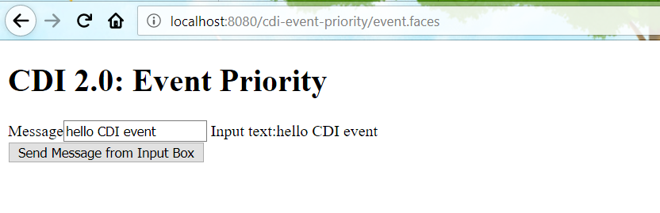

# Event Priority

If there are multi CDI `@Obsevers` methods defined, in the former CDI, there is no way to ensure they are executed in a certain order.

In CDI 2.0, this gap is filled by `@Priority`.

Let's create a simple example to demonstrate it.

Create a bean to fire a CDI `Event`.

```java
@ViewScoped
@Named("eventBean")
public class EventBean implements Serializable {

    private static final Logger LOG = Logger.getLogger(EventBean.class.getName());

    @Inject
    Event<Message> event;

    private String message;

    public String getMessage() {
        return message;
    }

    public void setMessage(String message) {
        this.message = message;
    }

    public void fireEvent() {
        LOG.log(Level.INFO, "fire event async...");
        event.fire(new Message(this.message));
    }

}
```

The event payload `Message`.

```java
public class Message implements Serializable {

    private String content;

    Message() {
    }

    Message(String content) {
        this.content = content;
    }

    public String getContent() {
        return content;
    }

    public void setContent(String content) {
        this.content = content;
    }

    @Override
    public int hashCode() {
        int hash = 7;
        hash = 79 * hash + Objects.hashCode(this.content);
        return hash;
    }

    @Override
    public boolean equals(Object obj) {
        if (this == obj) {
            return true;
        }
        if (obj == null) {
            return false;
        }
        if (getClass() != obj.getClass()) {
            return false;
        }
        final Message other = (Message) obj;
        if (!Objects.equals(this.content, other.content)) {
            return false;
        }
        return true;
    }

    @Override
    public String toString() {
        return "Message{" + "content=" + content + '}';
    }

}
```

Observes the events.

```java
@ApplicationScoped
public class EventHandler implements Serializable {

    public static final Logger LOG = Logger.getLogger(EventHandler.class.getName());

    public void onMessage(@Observes @Priority(value = 1) Message message) {
        LOG.log(Level.INFO, "observes event with @Priority(value = 1):{0}", message);
    }

    public void onAnotherMessage(@Observes @Priority(value = 2) Message message) {
        LOG.log(Level.INFO, "observes event  @Priority(value = 2):{0}", message);
    }
}
```

Run this application on Glassfish, open browser and navigate to .



Input some message in the input box, you will see the similar info in IDE console.

```text
Info:   observes event with @Priority(value = 1):Message{content=hello CDI event}
Info:   observes event  @Priority(value = 2):Message{content=hello CDI event}
```

Grab the [source codes](https://github.com/hantsy/ee8-sandbox) from my GitHub account, and have a try.

