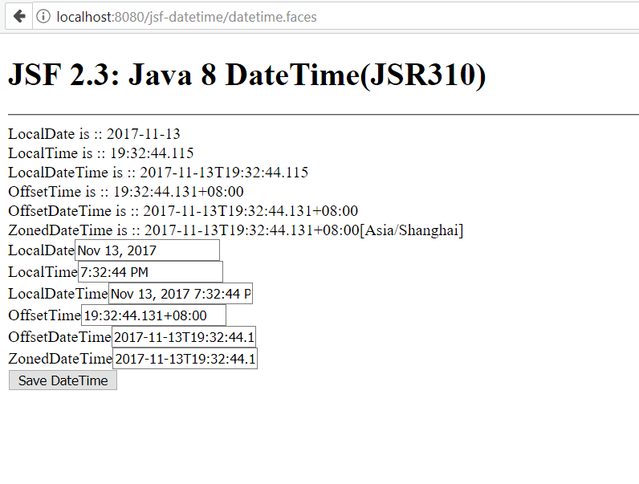

# Java 8 DateTime support

JSF 2.3 add alignments with Java 8, including Java 8 DateTime APIs.

The `f:convertDateTime` supports the following DateTime types from Java 8.

* LocalDate
* LocalDateTime
* LocalTime
* OffsetTime
* OffsetDateTime
* ZonedDateTime

Let's write a simple sample to try it.

Create a backing bean.

```java
@ViewScoped
@Named("dateTimeBean")
public class DateTimeBean implements Serializable {

    private static final Logger LOG = Logger.getLogger(DateTimeBean.class.getName());

    private LocalDate localDate = LocalDate.now();
    private LocalTime localTime = LocalTime.now();
    private LocalDateTime localDateTime = LocalDateTime.now();
    private OffsetTime offsetTime = OffsetTime.now();
    private OffsetDateTime offsetDateTime = OffsetDateTime.now();
    private ZonedDateTime zonedDateTime = ZonedDateTime.now();

    public LocalDate getLocalDate() {
        return localDate;
    }

    public void setLocalDate(LocalDate localDate) {
        this.localDate = localDate;
    }

    public LocalTime getLocalTime() {
        return localTime;
    }

    public void setLocalTime(LocalTime localTime) {
        this.localTime = localTime;
    }

    public LocalDateTime getLocalDateTime() {
        return localDateTime;
    }

    public void setLocalDateTime(LocalDateTime localDateTime) {
        this.localDateTime = localDateTime;
    }

    public OffsetTime getOffsetTime() {
        return offsetTime;
    }

    public void setOffsetTime(OffsetTime offsetTime) {
        this.offsetTime = offsetTime;
    }

    public OffsetDateTime getOffsetDateTime() {
        return offsetDateTime;
    }

    public void setOffsetDateTime(OffsetDateTime offsetDateTime) {
        this.offsetDateTime = offsetDateTime;
    }

    public ZonedDateTime getZonedDateTime() {
        return zonedDateTime;
    }

    public void setZonedDateTime(ZonedDateTime zonedDateTime) {
        this.zonedDateTime = zonedDateTime;
    }


}
```

Create a facelets template to accept input fields and render the values.

```markup
<h:panelGroup layout="block" id="messageFromInputBox">
    LocalDate is :: #{dateTimeBean.localDate} <br />
    LocalTime is :: #{dateTimeBean.localTime} <br />
    LocalDateTime is :: #{dateTimeBean.localDateTime} <br />
    OffsetTime is :: #{dateTimeBean.offsetTime} <br />
    OffsetDateTime is :: #{dateTimeBean.offsetDateTime} <br />
    ZonedDateTime is :: #{dateTimeBean.zonedDateTime} <br />
</h:panelGroup>
<h:form id="form">
    <div>
        <h:outputLabel for="localDate" value="LocalDate" />
        <h:inputText 
            id="localDate" 
            value="#{dateTimeBean.localDate}">
            <f:convertDateTime type="localDate"/>
        </h:inputText>    
    </div>
    <div>
        <h:outputLabel for="localTime" value="LocalTime" />
        <h:inputText 
            id="localTime" 
            value="#{dateTimeBean.localTime}">
            <f:convertDateTime type="localTime"/>
        </h:inputText>    
    </div>
    <div>
        <h:outputLabel for="localDateTime" value="LocalDateTime" />
        <h:inputText 
            id="localDateTime" 
            value="#{dateTimeBean.localDateTime}">
            <f:convertDateTime type="localDateTime"/>
        </h:inputText>    
    </div>

    <div>
        <h:outputLabel for="offsetTime" value="OffsetTime" />
        <h:inputText 
            id="offsetTime" 
            value="#{dateTimeBean.offsetTime}">
            <f:convertDateTime type="offsetTime"/>
        </h:inputText>    
    </div>

    <div>
        <h:outputLabel for="offsetDateTime" value="OffsetDateTime" />
        <h:inputText 
            id="offsetDateTime" 
            value="#{dateTimeBean.offsetDateTime}">
            <f:convertDateTime type="offsetDateTime"/>
        </h:inputText>    
    </div>

     <div>
        <h:outputLabel for="zonedDateTime" value="ZonedDateTime" />
        <h:inputText 
            id="zonedDateTime" 
            value="#{dateTimeBean.zonedDateTime}">
            <f:convertDateTime type="zonedDateTime"/>
        </h:inputText>    
    </div>

    <div>
        <h:commandButton 
            id="saveDateTime" 
            value="Save DateTime">
            <f:ajax execute="@form" render=":messageFromInputBox" />
        </h:commandButton>
    </div>
</h:form>
```

Run the project in NetBeans IDE, after it is deployed successfully, open your browser and navigate to [http://localhost:8080/jsf-datetime](http://localhost:8080/jsf-datetime/datetime.faces).



Grab the [source codes](https://github.com/hantsy/ee8-sandbox) from my GitHub account, and have a try.

