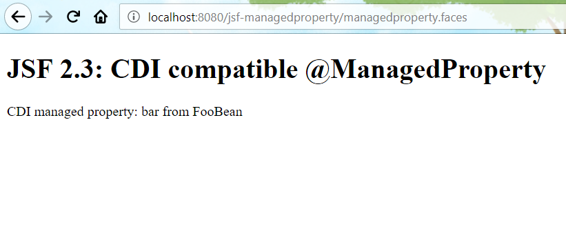

# CDI compatible @ManagedProperty

In JSF 2.3, the built-in scope annotations are deprecated, there are some alternatives provided in CDI, eg. `ApplicationScoped`, `SessionScope`, `RequestScoped`, etc.

In JSF 2.2, JSF itself provided a CDI compatible `ViewScoped`, [go here](https://github.com/hantsy/ee7-sandbox/wiki/jsf-cdi) to view more details.

There is an exception, we can not find an alternative for the legacy `@ManagedProperty`, there is a [useful blog entry](http://www.manorrock.com/blog/2013/11/01/jsf_tip_31_migrate_your_managedproperty_annotations.html) describe how to created a CDI compatible `@ManagedProperty` from scratch.

Fortunately, JSF 2.3 provides a built-in CDI implementation.

Let's create a sample to try it.

Create a simple backing bean.

```java
import javax.faces.annotation.ManagedProperty;
//...other imports

@Model
public class BackingBean {

    @Inject
    @ManagedProperty("#{fooBean.bar}")
    private String message;

    public String getMessage() {
        return message;
    }

    public void setMessage(String message) {
        this.message = message;
    }

}
```

**NOTE**, `@ManagedProperty` is from package `javax.faces.annotation`, which is newly added in JSF 2.3.

`fooBean` is a CDI bean, which has a property named `bar`.

```java
@Named
public class FooBean {

    private String bar = "bar from FooBean";

    public String getBar() {
        return bar;
    }

    public void setBar(String bar) {
        this.bar = bar;
    }
}
```

In the facelets template, display the message of `BackingBean`.

```markup
<div>
    CDI managed property: #{backingBean.message}    
</div>
```

Run this application on Glassfish v5, open your browser and navigate to [http://localhost:8080/jsf-managedproperty/managedproperty.faces](http://localhost:8080/jsf-managedproperty/managedproperty.faces).



Grab the [source codes](https://github.com/hantsy/ee8-sandbox) from my GitHub account, and have a try.

