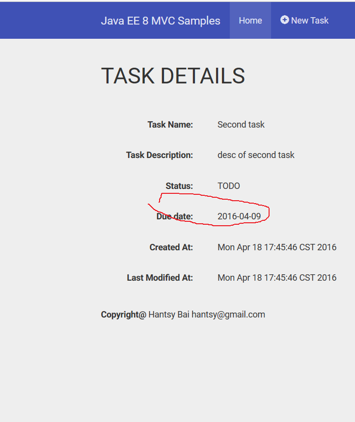

#Parameter conversion

Spring MVC provides `ConversionService` to convert data to bean target type from from data. 

In MVC, we can use custom `ParamConverter` to convert form data to the target type. 

##Parameter conversion

As an example, add a `dueDate` to `Task` entity. We need to convert the form field value(it is a `String`)  to `LocalDate` type.

1. Create a custom `ParamConverterProvider` for `LocalDate`.

		@Provider
		public class CustomConverterProvider implements ParamConverterProvider {

			final DateTimeFormatter DATE_FORMAT = DateTimeFormatter.ISO_DATE;

			@Override
			public <T> ParamConverter<T> getConverter(Class<T> rawType, Type genericType, Annotation[] annotations) {

				if (rawType.getName().equals(LocalDate.class.getName())) {

					return new ParamConverter<T>() {
						@Override
						public T fromString(String value) {
							return value != null ? (T) LocalDate.parse(value, DATE_FORMAT) : null;
						}

						@Override
						public String toString(T value) {
							return value != null ? ((LocalDate) value).format(DATE_FORMAT) : "";
						}
					};
				} 
				....
		}
		

2. Add a new field dueDate  to `TaskForm`, which type is `LocalDate`.

	    @NotNull
		@FormParam("duedate")
		private LocalDate dueDate;

4. In the view, add a new form field named `duedate`.

		<input type="text" id="duedate" name="duedate" class="form-control" placeholder="Due date"/>

When the form is submitted, the `duedate` will be converted to `LocalDate` type and bind to `dueDate` property of `TaskForm`.
	
##Format

Spring provides Formatting service in the display view. eg. `@DateFormat` and custom Formatters. 

Unfortunately, MVC does not support such features. And JSTL `fmt:formatDate` does not accept Java 8 DateTime APIs.

We can define a custom CDI beans for date formatting, and call it via expression language.

1. Create `RequestScoped` bean `Formatters`.

		@RequestScoped
		@Named("formatters")
		public class Formatters {

			static DateTimeFormatter DATE_FORMATTER = DateTimeFormatter.ISO_DATE;

			public String formatDate(LocalDate data) {
				return DATE_FORMATTER.format(data);
			}

		}
 
2. Apply it on the `dueDate` in the details.jspx page.
 
		<dt>Due date:</dt>
        <dd>${formatters.formatDate(details.dueDate)}</dd>

The result looks like:

##Source Codes

1. Clone the codes from my github.com account.

    [https://github.com/hantsy/ee8-sandbox/](https://github.com/hantsy/ee8-sandbox/)
	
2. Open the **mvc** project in NetBeans IDE.
3. Run it on Glassfish.
4. After it is deployed and runging on Glassfish application server, navigate [http://localhost:8080/ee8-mvc/mvc/tasks](http://localhost:8080/ee8-mvc/mvc/tasks) in browser.

