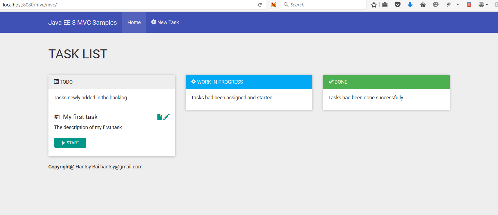

# Getting started with Java EE 8 MVC

MVC is a new specification introduced in the upcoming Java EE 8. 

It is based on the existing JAXRS. 

**At the moment I wrote down these posts, most of Java EE 8 specficitaions are still in the early disscussion stage, and MVC 1.0 is also not finalized, maybe some changes are included in future. I will update the [Wiki pages]() and codes aglined with final Java EE 8 specficitaions when it is released.**

I will use the latest Java 8, Glassfish 4.1.1, and NetBeans IDE for these posts.

## Prequisition

* Oracle JDK 8 or OpenJDK 8

  Oracle Java 8 is required, go to [Oracle Java website](http://java.oracle.com) to download it and install into your system. 
     
  Optionally, you can set **JAVA\_HOME** environment variable and add *&lt;JDK installation dir>/bin* in your **PATH** environment variable.

* The latest Apache Maven
   
  Download the latest Apache Maven from [http://maven.apache.org](http://maven.apache.org), and uncompress it into your local system. 
    
  Optionally, you can set **M2\_HOME** environment varible, and also do not forget to append *&lt;Maven Installation dir>/bin* your **PATH** environment variable.  

* NetBeans IDE
 
  Download the latest NetBeans IDE from [http://www.netbeans.org](http://www.netbeans.org), and installed it into your local disk.
  
* Glassfish Server

  Download the latest Glassfish from [Glassfish official website](http://glassfish.java.net). Currently the latest GA version is 4.1.1. Extracted it into your local disk.
  
*NOTE: You can download the JDK and NetBeans bundle from Oracle website instead of installing JDK and NetBeans IDE respectively.*    
  
After you installed all of these, start NetBeans IDE, add Glassfish into *Service* tab in NetBeans IDE.

## The Sample application

To demonstrate the basic usage of MVC spection, I will port the task board sample which I have implemented in the [Spring4 Sandbox](https://github.com/hantsy/spring4-sandbox/) to demonstrate Spring MVC.

Simply, it includes the following features.

1. List tasks by status, display the tasks in 3 columns(like a simple kanban).
2. Create a new task.
3. Edit and update task.
4. Update task stauts(move to different columns in the task list).
5. Delete task if it is done.
  
## Create a project skeleton 

First of first, you should create a simple project skeleton as start point.

If you are using NetBeans IDE, it is easy to create a Maven based Java EE 7 web project in IDE directly, and add the registered Glassfish as runtime server.

It should include Java EE 7 web artifact as the dependency.

```xml
<dependency>
	<groupId>javax</groupId>
	<artifactId>javaee-web-api</artifactId>
	<version>8.0</version>
	<scope>provided</scope>
</dependency>	
```
	
Add additional MVC api and the implemnetation dependencies.

```xml
<dependency>
	<groupId>javax.mvc</groupId>
	<artifactId>javax.mvc-api</artifactId>
	<version>1.0-edr2</version>
</dependency>
<dependency>
	<groupId>org.glassfish.ozark</groupId>
	<artifactId>ozark</artifactId>
	<version>1.0.0-m02</version>
	<scope>runtime</scope>
</dependency>
```

**ozark** is the default reference implemnetation of MVC 1.0 specificaiton, which will shipped with Glassfish 5. Currently it is still under active development, what we are using here may be changed in the future.

Here we used Glassfish 4.1.1 as target runtime, so you should include them in the deployment package. 

When Glassfish 5 is ready for Java EE 8, these two dependencies can be excluded and removed from POM.

## Declare the MVC application

MVC does not reinvent the wheel, it reuses the effort of JAXRS specificaiton.

Similar with activiating JAXRS application, You can declare a custom `Application` as our MVC application entry.

```java
@ApplicationPath("mvc")
public class MvcConfig extends Application {

	@Override
	public Set<Class<?>> getClasses() {
		return Collections.singleton(TaskController.class);
	}
}
```	
	
`TaskController` is a controller, it acts as the **C** in **MVC** pattern.

## Controller

MVC uses a `@Controller` annotation to declare a JAXES resource as Controller.

```java
@Path("tasks")
@Controller
public class TaskController {

	@GET
	@View("tasks.jspx")
	public void allTasks() {
		log.log(Level.INFO, "fetching all tasks");

		List<Task> todotasks = taskRepository.findByStatus(Task.Status.TODO);
		List<Task> doingtasks = taskRepository.findByStatus(Task.Status.DOING);
		List<Task> donetasks = taskRepository.findByStatus(Task.Status.DONE);

		log.log(Level.INFO, "got all tasks: todotasks@{0}, doingtasks@{1}, donetasks@{2}", new Object[]{todotasks.size(), doingtasks.size(), donetasks.size()});

		models.put("todotasks", todotasks);
		models.put("doingtasks", doingtasks);
		models.put("donetasks", donetasks);

	}
}
```	

`@View` annotation indicates the view(eg. JSP pages) a void method will return. 

## Model

`Models` is a contrainer to hold the model datas that will be transfered to the view.

## View

Have a look at the `tasks.jspx` file, I just copied some code snippets here, please checkout the source codes for details.

```xml
<div class="col-md-4 col-xs-12">
	<div class="panel panel-default">
		<!-- Default panel contents -->
		<div class="panel-heading">
			<span class="glyphicon glyphicon-list-alt" aria-hidden="true"><jsp:text /></span>
			TODO
		</div>
		<div class="panel-body">
			<p>Tasks newly added in the backlog.</p>
		</div>

		<!-- List group -->
		<c:if test="${not empty todotasks}">
			<ul id="todotasks" class="list-group">
				<c:forEach var="task" begin="0" items="${todotasks}">
					<li class="list-group-item">
						<h4>
							<span>#${task.id} ${task.name}</span> <span class="pull-right">
								<c:url var="taskUrl" value="tasks/${task.id}" /> <c:url
									var="taskEditUrl" value="tasks/${task.id}/edit" /> <a
									href="${taskUrl}"> <span class="glyphicon glyphicon-file"
														 aria-hidden="true"><jsp:text /></span>
								</a> <a href="${taskEditUrl}"> <span
										class="glyphicon glyphicon-pencil" aria-hidden="true"><jsp:text /></span>
								</a>
							</span>
						</h4>
						<p>${task.description}</p>
						<p>
							<c:url var="markDoingUrl"
								   value="/mvc/tasks/${task.id}/status" />
						<form action="${markDoingUrl}" method="post">
							<input type="hidden" name="_method" value="PUT"><jsp:text /></input>
							<input type="hidden" name="status" value="DOING"><jsp:text /></input>
							<button type="submit" class="btn btn-sm btn-primary">
								<span class="glyphicon glyphicon-play" aria-hidden="true"><jsp:text /></span>
								START
							</button>
						</form>
						</p>
					</li>
				</c:forEach>
			</ul>
		</c:if>
	</div>
</div>
```	

No surprise, just pure JSP files, I used the JSP xml form in this sample. 

By default the views should be put in the */WEB-INF/views* folder in projects.

In this example, when you send a **GET** request to */ee8-mvc/mvc/tasks*, the `allTasks()` method will handle this request, then find data(tasks by status here) from database, and put the query results into a `Models` container, in the view pages the model data can be accessed via **el** directly.

The path(*/ee8-mvc/mvc/tasks*) is the combination of context path, mvc application path, and controller path.


## Source codes

1. Clone the codes from my github.com account.

    [https://github.com/hantsy/ee8-sandbox/](https://github.com/hantsy/ee8-sandbox/)
	
2. Open the **mvc** project in NetBeans IDE.
3. Run it on Glassfish server.
4. After it is deployed and running on the Glassfish application server, navigate [http://localhost:8080/ee8-mvc/mvc/tasks](http://localhost:8080/ee8-mvc/mvc/tasks) in your favorite browser.

    
