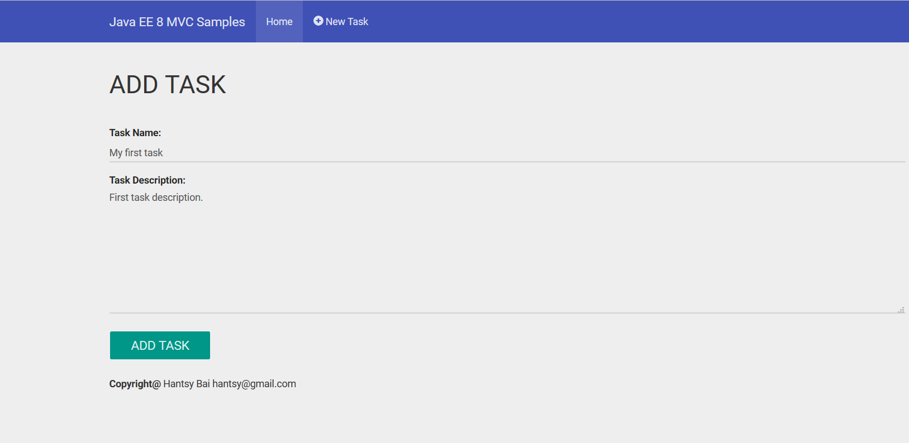

# Handling form submission

In the tranditional MVC applications, the mostly-used HTML methods should **GET** and **POST**. 

POST method is usually used in the form submission, aka form post.

In order to create a new task, you should follow the flow.

1. In the task list view, click **Add Task** button to enter the creating task view.
2. Fill the fields of the task form and submit. It will return to task list view.

## Display the creating page

Firstly display the task creating page.

```java
@GET
@Path("new")
public Viewable add() {
	log.log(Level.INFO, "add new task");

	return new Viewable("add.jspx");
}
```	

`Viewable` is another approach to indicate a view path, I have motioned the `@View` annotation in the first post.

The *add.jspx* page code snippets.

```xml
<div class="row">
	<div class="col-md-12">
		<c:url var="formActionUrl" value="/mvc/tasks"/>
		<form id="form" name="form" role="form" class="form" action="${formActionUrl}" method="post">
			<div
				class="form-group">
				<label class="control-label" for="name">Task Name:</label>
				<input id="name" name="name" type="text" class="form-control"/>
				<div class="help-block">
					<jsp:text/>
				</div>
			</div>
			 <div
				class="form-group">
				<label class="control-label" for="description">Task Description:</label>
				<textarea id="description" name="description" class="form-control" rows="8"><jsp:text/></textarea>
				<div class="help-block">
					<jsp:text/>
				</div>
			</div>

			<div class="form-group">
				<button id="submitTask" type="submit" class="btn btn-lg btn-primary">Add Task</button>
			</div>
		</form>
	</div>
</div>
```	

Unlike other MVC frameworks, such as Spring MVC, MVC 1.0 does not provides specific taglib for form field wrapping. Most of the codes are pure HTML codes and some addtional standard JSTL taglib in JSP specification.

When the **Add Task** button is clicked, the form is submitted via POST method to the backend controller. 

## Handling form submission

Let's have a look at the controller to process the form submission.

```java
@POST
public Response save(@Valid @BeanParam TaskForm form) {
	log.log(Level.INFO, "saving new task @{0}", form);

	if (validationResult.isFailed()) {
		AlertMessage alert = AlertMessage.danger("Validation voilations!");
		validationResult.getAllViolations()
				.stream()
				.forEach((ConstraintViolation t) -> {
					alert.addError(t.getPropertyPath().toString(), "", t.getMessage());
				});
		models.put("errors", alert);
		return Response.status(BAD_REQUEST).entity("add.jsp").build();
	}

	Task task = new Task();
	task.setName(form.getName());
	task.setDescription(form.getDescription());

	taskRepository.save(task);

	flashMessage.notify(Type.success, "Task was created successfully!");

	return Response.ok("redirect:tasks").build();
}
```	

You could have notice there is `@BeanParam` annotation with `TaskForm` bean. 

Let's dig in the `TaskForm` code.

```java
@RequestScoped
public class TaskForm implements Serializable {

	private static final long serialVersionUID = 1L;

	@NotNull
	@FormParam("name")
	private String name;

	@NotNull
	@FormParam("description")
	private String description;
	
	//setters and getters are omitted.
	//equals and hashcode methods are omitted.
	
}	
```	

In the `TaskForm`, there are two fields defined, `name` and `description`, and they are annotated with a `@FormParam` annotation, it means the fields in the input form will be bound to these fields by name.

When the form is submitted, the value of input field named `name` will be bound to the `name` field of the `TaskForm` instance. The `save` method will read the form data and save it into database, and return to the task list view.


## Source codes

1. Clone the codes from my github.com account.

    [https://github.com/hantsy/ee8-sandbox/](https://github.com/hantsy/ee8-sandbox/)
	
2. Open the **mvc** project in NetBeans IDE.
3. Run it on Glassfish 4.1.1.
4. After it is deployed and runging on Glassfish application server, navigate [http://localhost:8080/ee8-mvc/mvc/tasks](http://localhost:8080/ee8-mvc/mvc/tasks) in browser.
5. Click the **Add Task** button and try to create a new task.

    
