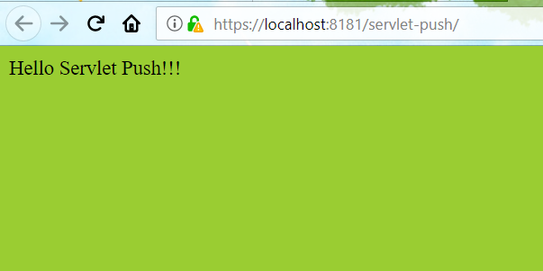
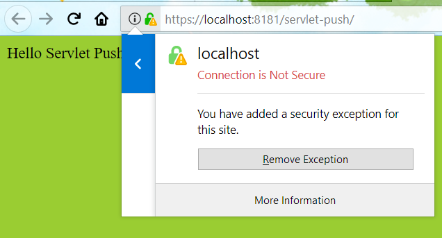

# Server Push

One highlight feature of HTTP/2 is Server Push. Servlet 4.0 add `PushBuilder` to handle push.

An exmaple of enable Servlet Push.

```java
@WebServlet(urlPatterns="")
@ServletSecurity(httpMethodConstraints={
        @HttpMethodConstraint(value="GET", transportGuarantee=CONFIDENTIAL) })
public class PushServlet extends HttpServlet {
    @Override
    protected void doGet(HttpServletRequest req, HttpServletResponse res)
            throws IOException, ServletException {
        PushBuilder pushBuilder = req.newPushBuilder().
            path("main.css");
        pushBuilder.push();
        res.getWriter().println("<html><head><title>HTTP2 Test</title><link rel=\"stylesheet\" href=\"main.css\"></head><body>Hello Servlet Push!!!</body></html>");
    }
}
```

Run this application on Glassfish v5, navigate to [http://localhost:8080/servlet-push/](https://localhost:8080/servlet-push/), it will redirect to [https://localhost:8181/servlet-push/](https://localhost:8181/servlet-push/) soon.



There is a warning flag on the https icon of address bar, the SSL certificate in Glassfish v5 is not recognised by Firefox. Click it and add `localhost` to the exception and make Firefox trust it.





Grab the [source codes](https://github.com/hantsy/ee8-sandbox) from my github account, and have a try.